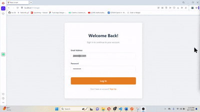
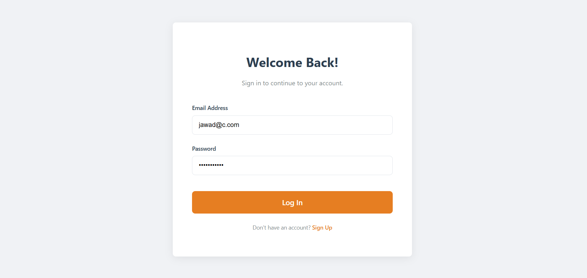
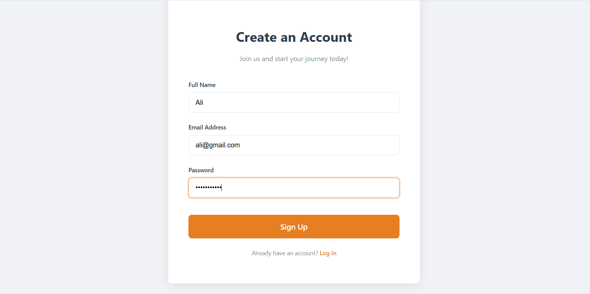
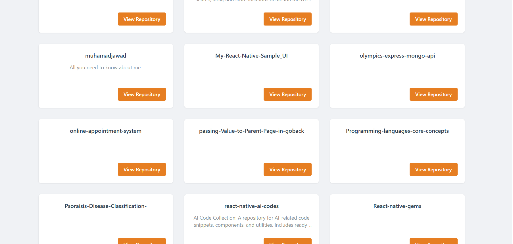
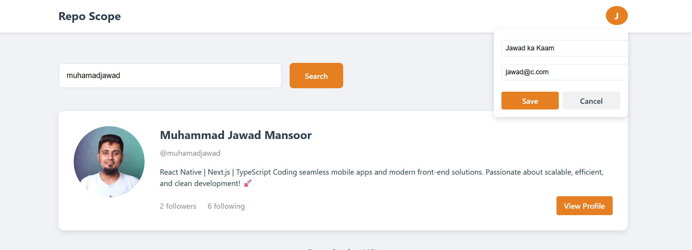
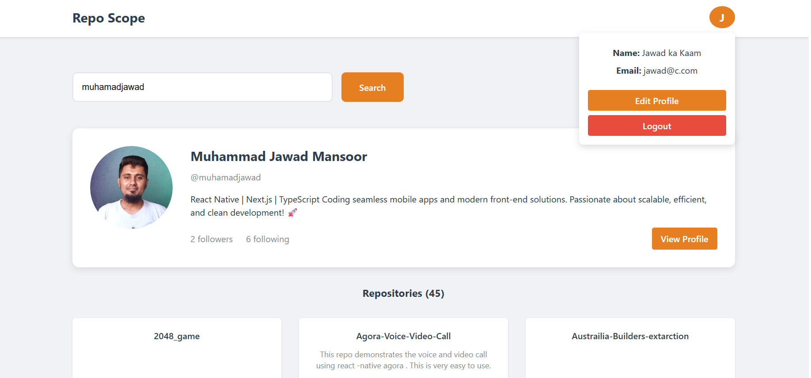
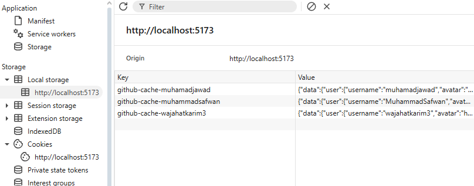

# Repo Scope

This repository contains a full-stack user management application with a React frontend and a Node.js backend. The application allows users to register, log in, manage their profile, and view their GitHub repositories.

## Demo



Here are some screenshots of the application:

| Login | Signup | Home (User Profile) |
| --- | --- | --- |
|  |  |  |

| Edit Profile | Repo List | Cache |
| --- | --- | --- |
|  |  |  |


## Setup

The project is divided into two main parts: `client` and `server`.

### Client (React + TypeScript + Vite)

To run the client application:

1.  Navigate to the `client` directory:
    ```bash
    cd client
    ```
2.  Install the dependencies:
    ```bash
    npm install
    ```
3.  Run the development server:
    ```bash
    npm run dev
    ```

### Server (Node.js + Express + TypeScript)

To run the server:

1.  Navigate to the `server` directory:
    ```bash
    cd server
    ```
2.  Install the dependencies:
    ```bash
    npm install
    ```
3.  Run the development server:
    ```bash
    npm run dev
    ```

## API Endpoints

The server exposes the following API endpoints:

| Method | Endpoint | Description |
| --- | --- | --- |
| POST | `/register` | User registration. |
| POST | `/login` | User login. |
| GET | `/profile` | Get the profile of the authenticated user. |
| PUT | `/profile` | Update the profile of the authenticated user. |
| GET | `/user-repos` | Get the GitHub repositories of a user. |
